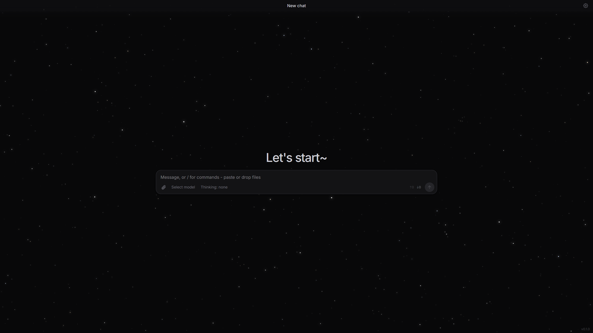

<div align="center">

# Extension AI Chat



**A Firefox extension for local AI chatting** *beta!!*

[](LICENSE)
[](#installation)
[](#installation)

</div>

## Purpose

The extension is designed for interaction with LLMs through open and commercial HTTP APIs. Unlike the native solutions of individual providers, ExtChat acts as a **universal client**: a single interface is used to communicate with different services, while the list of configured services, their parameters, and access keys are stored locally on the user's machine.

## Capabilities

- **Arbitrary API endpoints.** The principal exchange formats are supported: *OpenAI Responses*, *Chat Completions*, and *Messages* (Anthropic). Ready-made profiles are provided for OpenAI, Anthropic, Google AI, OpenRouter, Groq, and Ollama, along with a custom profile for any other endpoint.
- **Generation parameters.** Temperature, top-p, top-k, token limits, and response streaming are available. Unspecified parameters are not transmitted to the server.
- **System prompt and profiles.** The system instruction is configured separately and may be saved as named presets for quick switching.
- **Model selection.** The list of models is requested automatically from the connected service; search is performed as you type. The *thinking effort* is configured separately for models with corresponding support.
- **Response formatting.** Markdown is supported, along with mathematical formulas (KaTeX) and sanitised embedded content (DOMPurify).
- **File handling.** Images and files may be attached to a message via the file picker, clipboard paste, or drag-and-drop.
- **Token accounting.** The interface displays the number of tokens sent and received within the current conversation.
- **Conversation history.** Conversations are stored locally and remain available at any time; management is performed through the command palette (`/new`, `/chats`, `/model`, `/thinking`, `/clear`, and others).
- **Request log.** A built-in logging panel displays outgoing requests and service events, which simplifies configuration diagnostics.
- **Appearance settings.** Interface themes, UI scaling, and other presentation parameters are configurable.
- **Idle mode.** When no user activity is detected, the interface dims smoothly while an animated starfield fades in; any input restores the normal state.

### Supported protocols and services

| Protocol | Typical services |
|---|---|
| OpenAI **Responses** | OpenAI, compatible gateways |
| OpenAI **Chat Completions** | OpenAI, Google AI, OpenRouter, Groq, Ollama, custom endpoints |
| Anthropic **Messages** | Anthropic (Claude) |

> Custom endpoints may expose any base URL; the request format is selected per provider.

## Remark

Avalible **only** desktop version, mobile version in *beta*, because mobile firefox app - **don't support** extensions; *I might look into this in the future*

## Privacy

The extension operates no servers of its own and transmits no data to third parties beyond the services the user explicitly addresses. All settings, access keys, and conversation history are stored **exclusively on the local device**. The data vault is encrypted (AES-GCM with a PBKDF2-derived key) and protected by a local passphrase. The application contains no external trackers; the third-party libraries employed are limited to markup processing and formula rendering.

## Installation

The extension is distributed as source code. To produce a ready build, run:

```bash
npm install
npm run build
```

The assembled extension resides in the `site/` directory and is loaded into a Gecko-based browser (Firefox 78 or newer) as a temporary add-on via the debugging page (`about:debugging` -> *Load Temporary Add-on*).

*Support for Chromium-based browsers is planned.*

<details>
<summary>Step-by-step loading in Firefox</summary>

1. Open `about:debugging#/runtime/this-firefox`.
2. Click **Load Temporary Add-on…**
3. Select the `site/manifest.json` file of the build.
4. Open the extension via the toolbar icon.

</details>

## Requirements

- Node.js with npm;
- a Gecko-based browser with Manifest V2 support (Firefox 78+);
- access to at least one compatible API service.

## Support

The project is developed on a voluntary basis, and any form of contribution is welcome. You may support the development in the following ways:

- **Pull requests.** Bug fixes, refactoring, and new features are accepted through pull requests to the [project repository](https://github.com/anissimov12/ExtChat). Substantive changes are reviewed and merged by the maintainer.
- **Forks.** Creating a fork for your own experiments or derivative builds is encouraged; please observe the terms of the GPLv3 licence.
- **Attribution.** Contributors whose changes are merged into the main branch are added to the built-in *About* dialog of the extension (`/about` command), so that their authorship is visible to every user.

## License

The project is distributed under the terms of the **GNU General Public License v3.0**. The full licence text is provided in the [LICENSE](LICENSE) file.